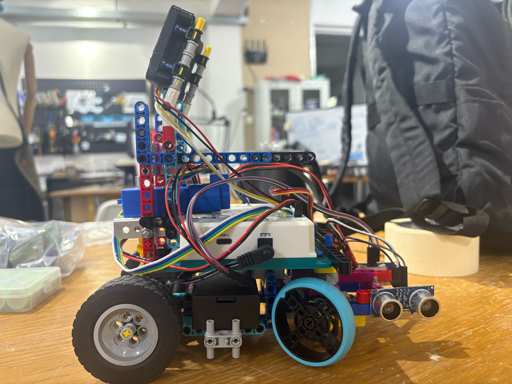
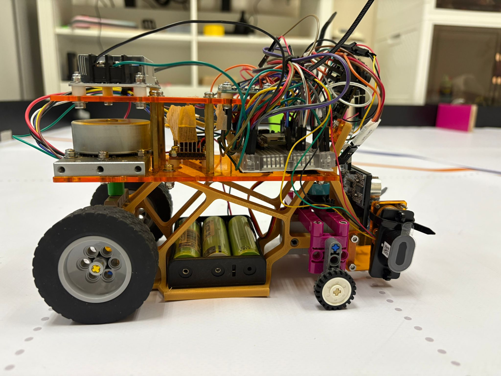

# Welcome to the GitHub Repository of Team Evo1ution for 2025 WRO Future Engineering 

## Links

[About Our Team](#about-our-team)

[Documentation](documentation/WROFEReport.pdf)

[Meeting Agenda & Minutes](https://docs.google.com/document/d/1UcRYFaWVR6Crpbr7qZHQyp-bxXoaFOH1-K7Gqp4DvTU/edit?usp=sharing)

[Pictures and Practice Videos](picsNveds)

[Practice Videos](picsNveds/videos_link.md)

[Our Code](https://github.com/OilRabbit/2025-WRO-Future-Engineer/tree/Gen-6.0_ESP32/main)

[Wiring Diagram](https://github.com/OilRabbit/2025-WRO-Future-Engineer/tree/Gen-6.0_ESP32/wiring)

## About Our Team

Our team is comprised of five Po Leung Kuk Tang Yuk Tien College alumni, each a former Robotics Team chairperson. Through years of competitions and training, we forged strong friendships and a shared passion for robotics. As avid World Robot Olympiad (WRO) supporters, we were excited to learn that the Future Engineer category age limit increased to 22 in 2025. In January, during a casual meetup, we resolved to reunite and compete together once again.

### Members' Introductions (from left to right)

#### Rex Sin (Participant) – Age 19
Rex is studying Computer Science in Australia, but remains fully engaged in our team via video conferencing. He leads strategy design, debugging, and solution development, produces and uploads our YouTube videos, and co-ordinates this report. He began robotics at age 12 and won the U.S. Robot Parade world championship represent-ing Hong Kong, later earning numerous local competition awards.

#### Donald Tong (Participant) – Age 19
Donald, a Civil and Environmental Engineering student and PLKTYTC Robotics Team coach, develops core li-braries and functions, fine-tunes robot behavior, and conducts extensive operational tests, such as evaluating var-ied object placements. He and Rex Sin earned second place in the 2024 WRO Hong Kong Senior Robomission selection, and he previously placed second in the 2019 international Beach Rescue and Salvage Robot contests.

#### Elwin Li (Coach) – Age 22
Elwin is an MPhil Physics student who previously coached the PLKTYTC Robotics Team and Physics Olympiad class. With expertise in physics, mathematics, and programming, he contributes to university research on gravita-tional waves. In our team, he directs meeting planning, goal setting, task assignment, sponsorship coordination, hardware procurement, and, most critically, programming strategy. Elwin also competed in the 2021 Robocon Hong Kong Contest and served as a judge for the 2024 WRO Hong Kong Future Engineer selection.

#### Harrison Tsang (Participant) – Age 20
Studying Artificial Intelligence: Systems and Technologies, Harrison coaches the PLKTYTC Robotics Team and leads our robot construction and primary program development. While preparing concurrently for the 2025 Ro-bocon Hong Kong Contest, he brought experience as the 2021 WRO Hong Kong Senior RoboMission champion and multiple world-title winner in international robotics that year.

#### Harold Cheung (Supporter) – Age 23
Harold is a final-year Aeronautical and Aviation Engineering student and former PLKTYTC Robotics Team coach, specializing in mechanical design and robot structures. In our team, he delivers vehicle fundamentals training, oversees mechanical design, advises on sensor integration and strategy, and assists with component procure-ment. A motorsport enthusiast and amateur go-kart racer, Harold has competed alongside Elwin in robotics con-tests for over ten years, even leveraging insights from his personal kart to inform our robot’s design.

----

## Our design for the Hong Kong Regional Copetition
During the WRO Hong Kong Regional Competition, we selected the MATRIX Mini R4 controller and some of its official motors and sensors. We believed that they should work well together to maximise the overall performance as they are all MATRIX electrical components. The chassis was built with LEGO and MATRIX components assisted with screwes to hold the electrical components. 

However, we found that the MATRIX controller has a high latency when handling multiple tasks and an unstable IMU sensor. These problems increased the diffculty of tuning the program because of errors caused by them. Thus, we decided to replace those electrical components with better models.

----

## Our current design

After doing some research about controllers that are often used in such competitions, we decided to separate into two sub-teams to work on EV3 and ESP32 separately. Despite the fact that EV3 has several limitations on both hardware and software, we still gave it a try, as we are all familiar with it. As a result, it has much higher stability than the MATRIX robot. However, the problem of gyro drift is critical, and the robot does not move fast enough. Meanwhile, we found that the ESP32 features multi-threading and powerful computing. From the result of testing the processing power of the ESP32 by replacing the MATRIX controller with the ESP32 while other electronic components remain the same, it showed its excellent performance and stability. Thus, we decided to work further on ESP32.

To further enhance performance, we replaced the MATRIX motor with the BM50 brushless motor with an encoder for the drive, which in-creases speed. It offers additional stability, acting like a gyroscope while in operation, and features a built-in en-coder for precise power control. Regarding the problematic sensors, we changed a better IMU (ICM-20948) and camera (PixyCam2.1). It is worth mentioning that the ultrasonic sensors were replaced by ToF sensors due to the fast measuring rate and high accuracy of ToF sensors.

----

## How do we work together
As a current college students, we need to balance our studies, works, and the preperation for this competition. Although our spare time do not collide much, we spent as much time as possible working on this project. Even though sometimes we need to work alone. By the way, thank to our coach and supporter for taking time from their busy schedule to come to our working place to give advises. We used GitHub to share code and log our work. We communicate through a WhatsApp group and have a short call with Rex regularly to update him about the condition for the documentations and strategy designs.

----

## What we learnt
* Slip angle optimisation is unnecessary for our small robot, the Ackermann effect is minimal, though we demonstrated a simple LEGO implementation regardless.
* A differential is essential: it significantly smooths turning at low speeds despite a slight reduction in straight‐line velocity.
* A shorter wheelbase enhances turning fluidity.
* A wider track during turns, greater spacing between front wheels than rear, improves cornering smooth-ness (we omitted this due to chassis‐width constraints).
* Lightweight wheels markedly increase top speed more than reducing overall vehicle mass.
* Smaller wheel diameters boost manoeuvrability.
* A low centre of mass enhances stability.
* An onboard gyro provides precise heading data and lap counting.
* Storing pillar colours in an array on the first detection enables faster reaction on subsequent passes.
* Reducing camera resolution (where feasible) increases frame rate and responsiveness.

----

## Conclusion
This is a really challenging project as this is our first time using those hardware and there are so many things need to learn for this. We enjoy the process of searching through the field we love and learning something new. We believe that what we learnt from this competition is more valuable than the result.

----

## Special thanks
Our sponsors:

| [Peach Creatice Production](https://www.peachcp.com/wp/) | [TURNED-E!](https://www.turned-e.com/) | [Scarlet Racing](https://www.facebook.com/scarlet.racing.hk/?locale=zh_HK) | Electronic Slash |
| -------- | -------- | -------- | -------- |
|||||

Also thank to our parents, coach and supporter for supporting us to explore the field we love.
